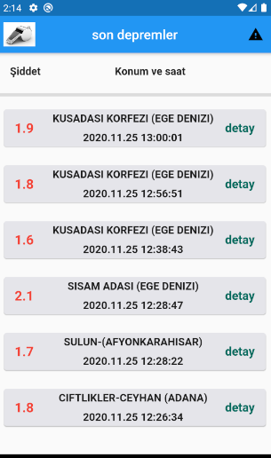
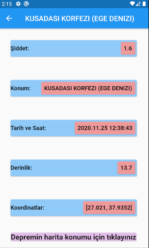
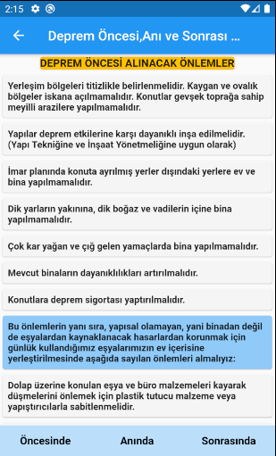
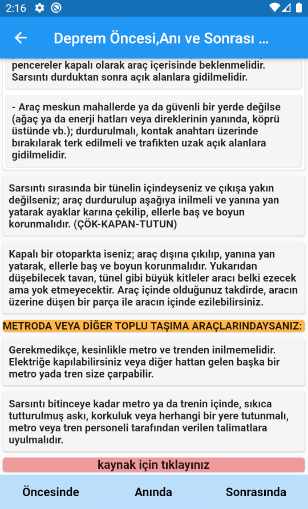

# Son dakika depremler

- Developer MultiCamp Flutter Kampı geçtiğimiz dersinde canlı yayında başladığımız. Uygulamaya eklemeler yaparak yayınlamak istedim.

* Kullandığım depremleri listeyen api : https://api.orhanaydogdu.com.tr/deprem/live.php
* Ses eklemek için **audioplayers**,
* url'den veri çekmek için **http**,
* google maps'e yönlendirmek için **maps_launcher**,
* web sitesine yönlendirmek için **url_launcher** paketlerini kullandım.

#### Ekran Görüntüleri

